# employee-spotlight-list
#### A full CRUD list app made with React and Redux in a Dockerfile

## Table of Contents

**[Quick Links](#Quick-Links)** 
**[First Looks](#First-Looks)** 
**[Set Up and Run Locally](#Set-Up-and-Run-Locally)** 
**[Set Up and Run in Docker](#Set-Up-and-Run-in-Docker)** 
**[Next Steps to Continue](#Next-Steps-to-Continue)** 

## Quick Links

### click here to view live site --> [ Employee Spotlight](https://employee-spotlight-list.netlify.app/)

## First Looks

### 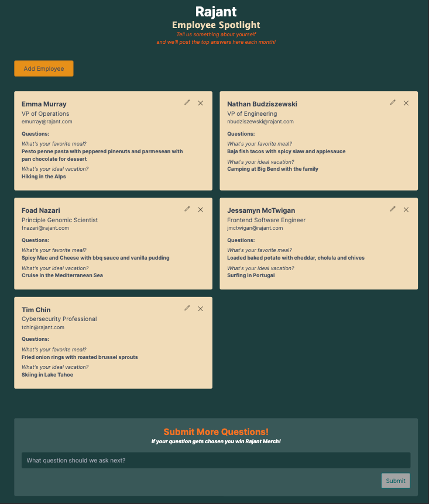
### 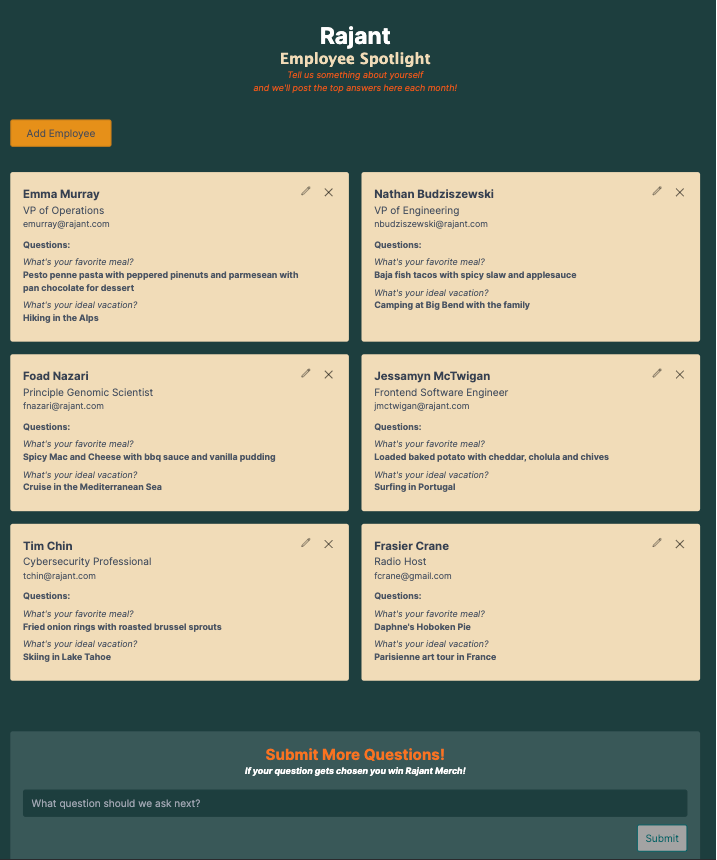
### 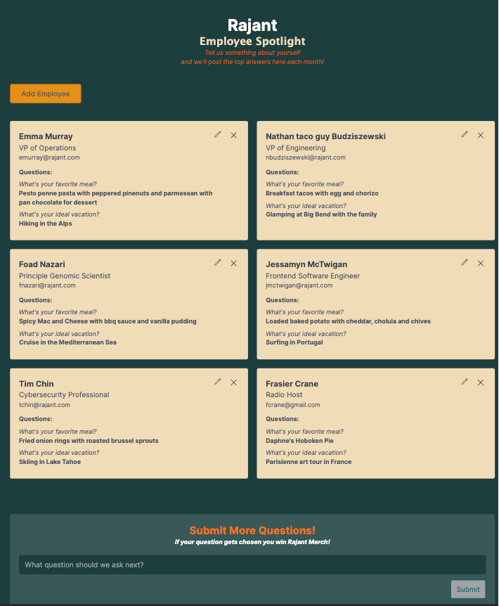
### 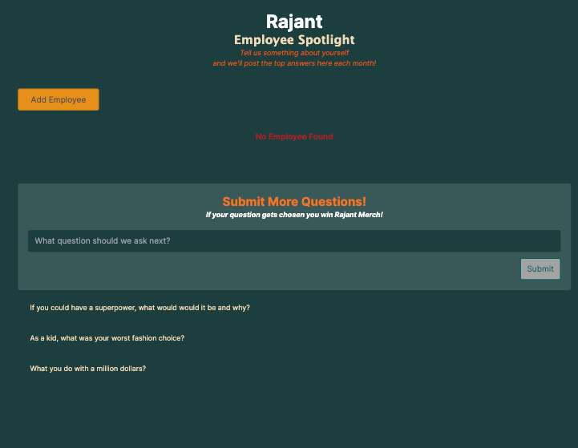
### 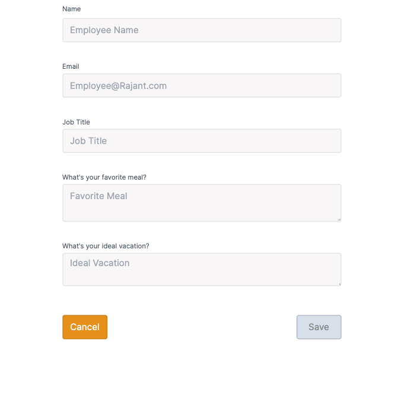
### 
### 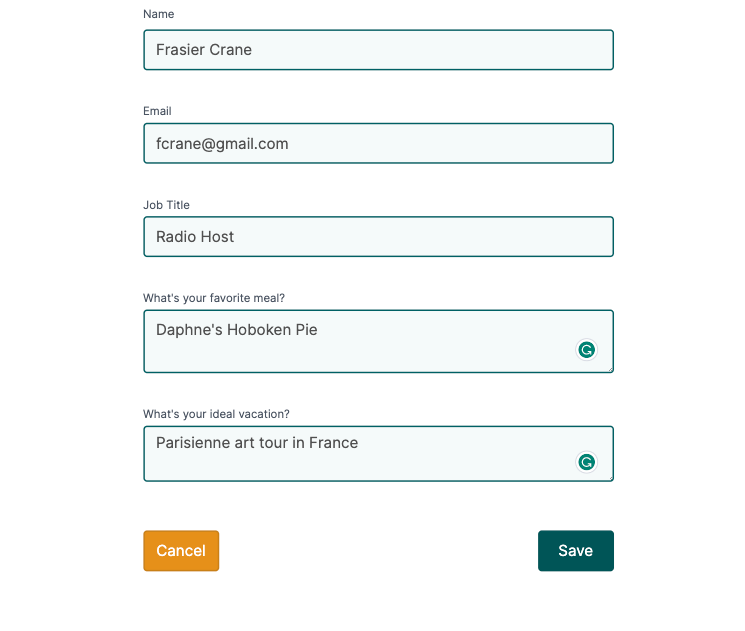
### 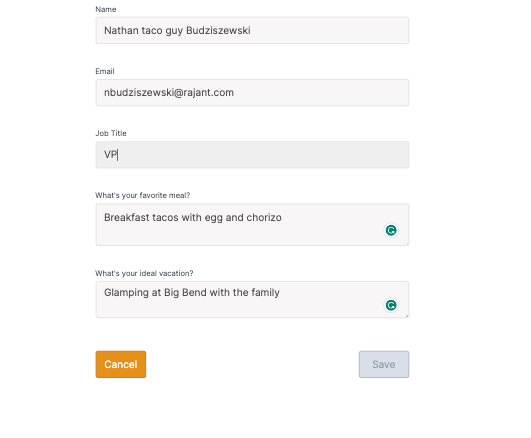
### 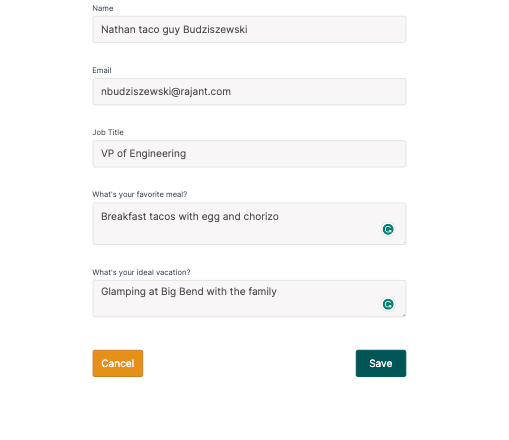
### 
### 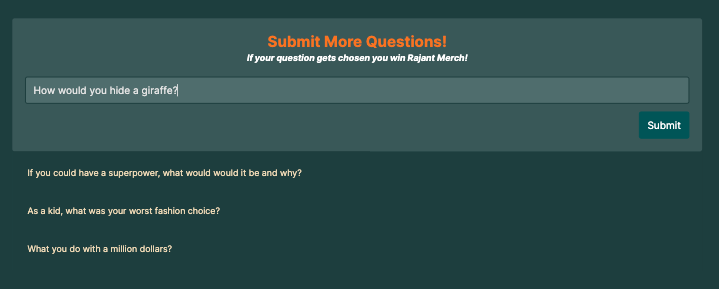
### 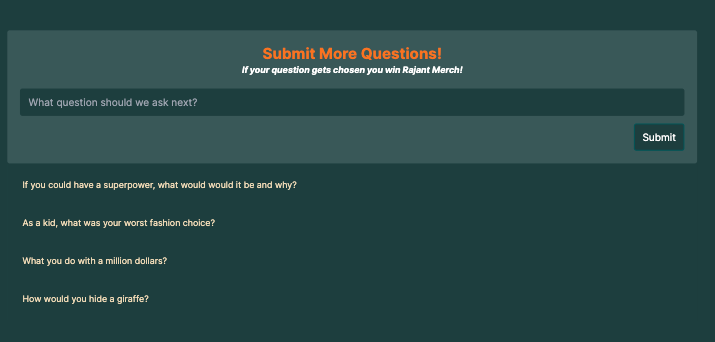
### 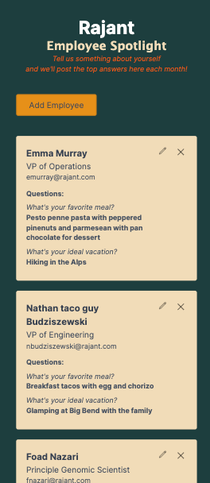
### 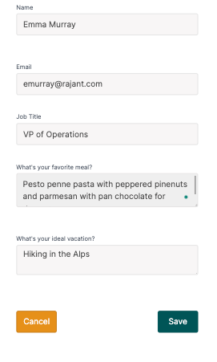

## Set Up and Run Locally
- 1. clone project on your local machine [cloning-a-repository](https://docs.github.com/en/repositories/creating-and-managing-repositories/cloning-a-repository)
- 2. open project in your IDE (ie: visual studio)
- 3. open the terminal at project root and npm install to load all dependencies and configurations
- 4. npm start will start and run the app in your browser [http://localhost:3000](http://localhost:3000)
- 5. The page will automatically reload when you save any changes and show lint warnings and errors

## Set Up and Run in Docker
- 1. I went ahead and published this dockerfile on docker hub to make it super easy to plug and play here [jessamyn/employee-spotlight-list](https://hub.docker.com/r/jessamyn/employee-spotlight-list/tags)
- 2. copy the tag and in the terminal run the the tag: docker pull jessamyn/employee-spotlight-list:latest
- 3. on mac open "docker desktop" and navigate to the tab "images"
- 4. you should see "jessamyn/employee-spotlight-list"  and click the play symbol
- 5. in the "optional settings" popup click the drop down button and under Host port add 4 digits like "8080" and click Run
- 6. naviate to [http://localhost:8080](http://localhost:8080)
- 6. on windows or linux you can do all this from the CLI here are a couple helpful links to get it up and running:
- [Pull Docker Image from Docker Hub and Run it](https://www.stacksimplify.com/aws-eks/docker-basics/get-docker-image-from-docker-hub-and-run-/)
- [docker pull in docs.docker.com](https://docs.docker.com/engine/reference/commandline/pull/)

## Next Steps to Continue

- more validation UI clean up and functionality such as error pop outs below invalid inputs on click and hover-over info tags
- accessibilty compliant tabbing functionality, UI and validation expanded
- test and clean up run time efficiency based on Google Analytics (image optimization, lazy-loading)
- create more reusable, flexible components for scalability, readability, and efficiency like form, inputs, error validation ect...
- scale out form template functionality so admin user can CRUD the form template for example, ability to change questions asked and adding more types of inputs like a photo or video
- scale out employee engagement functionality and UI with likes, comments, ranking and sorting card list

#### Objective:

- Front End (ReactJS):
- 1. Create a responsive user interface using ReactJS, Redux and Docker.
- 2. Users should be able to add, view, edit, and delete items from the list.
- 3. Validate user inputs (e.g. empty fields, invalid characters).
- 4. Implement error handling and display appropriate messages to the user.
- 6. Use CSS or CSS-in-JS solutions (e.g. styled-components) for styling.

## License

[MIT License](https://opensource.org/licenses/MIT)

**[Back Up To Top](#employee-spotlight-list)**
