# employee-spotlight-list
#### A full CRUD list app made with React and Redux in a Dockerfile

## Table of Contents

**[Quick Links](#Quick-Links)** 
**[First Looks](#First-Looks)** 
**[Set Up and Run Locally](#Set-Up-and-Run-Locally)** 
**[Set Up and Run in Docker](#Set-Up-and-Run-in-Docker)** 
**[Next Steps to Continue](#Next-Steps-to-Continue)** 
**[Acceptance Criteria](#Acceptance-Criteria)** 

## Quick Links

### click here to view --> [Employee Spotlight Live Website](https://jessamyn27.github.io/)

### click here to view --> [Demo Walkthru Video](https://)

## First Looks

# 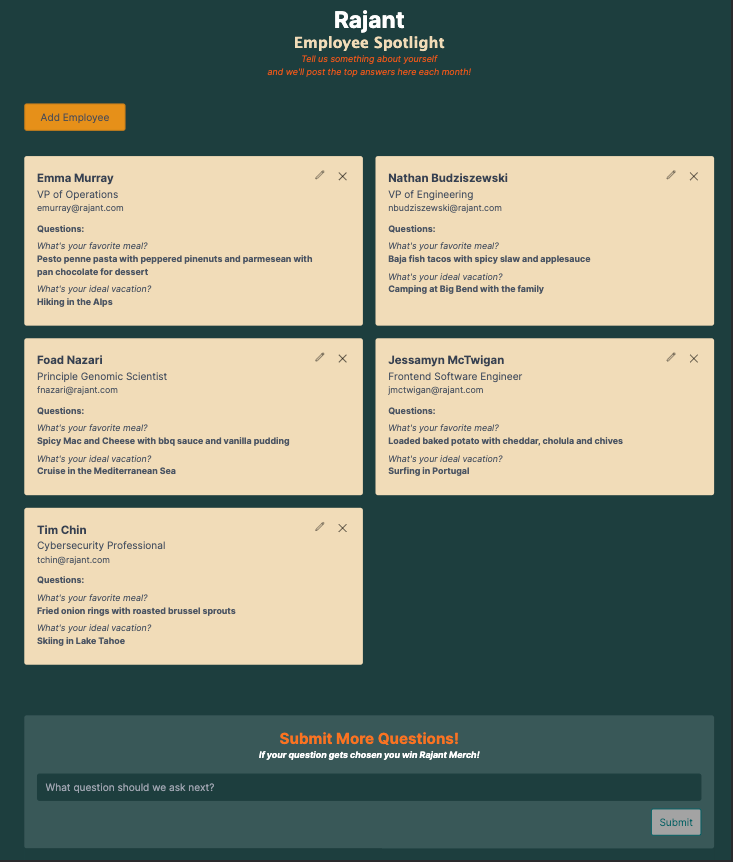
# 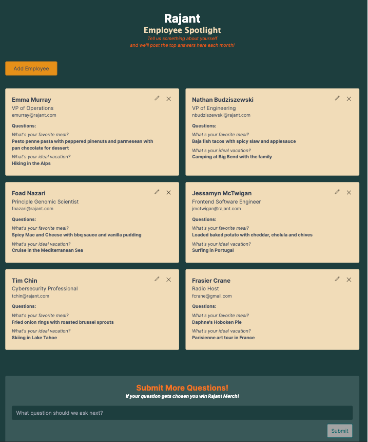
# 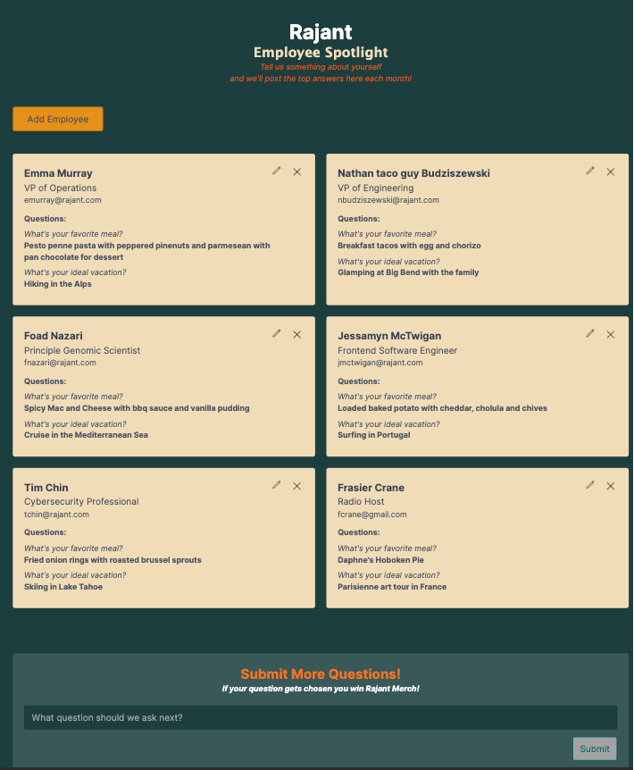
# 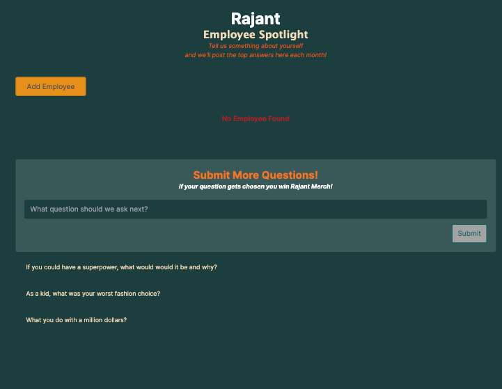
# 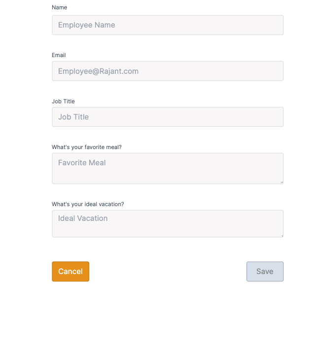
# 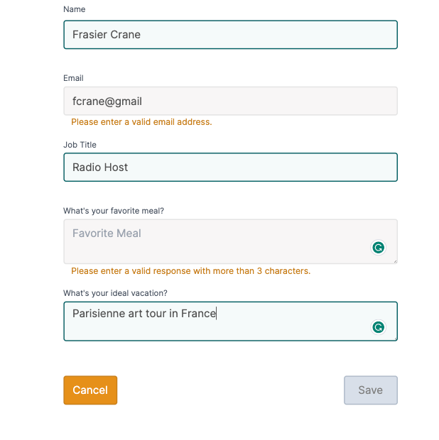
# 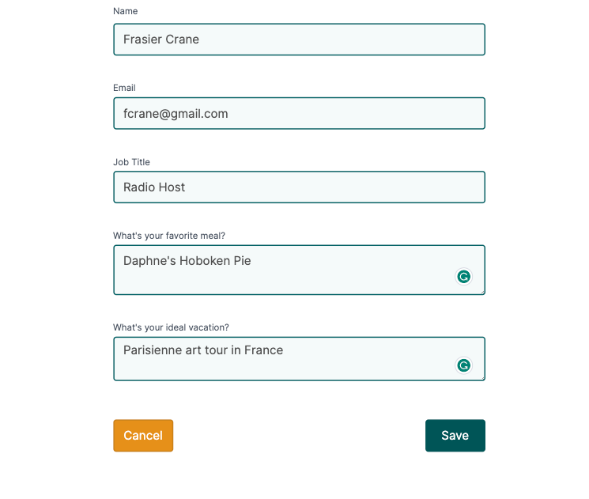
# 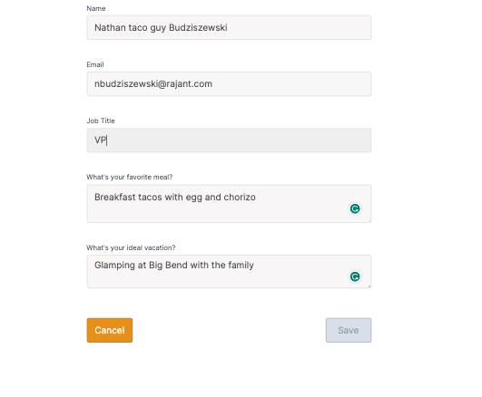
# 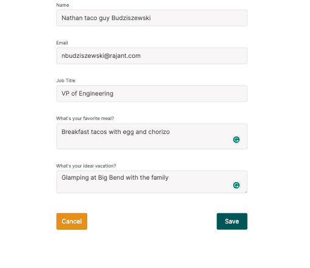
# 
# 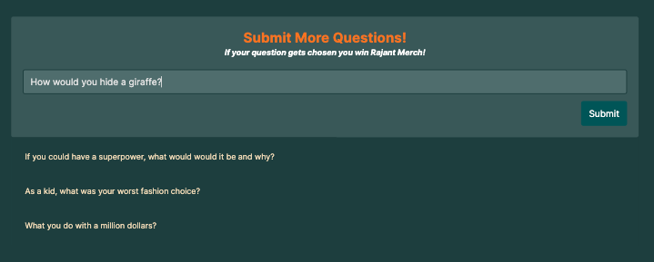
# 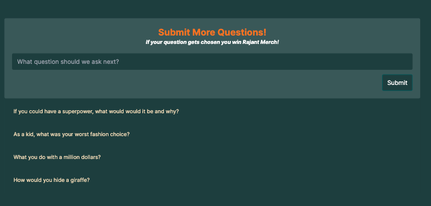
# 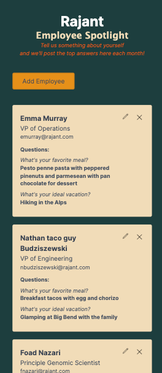
# 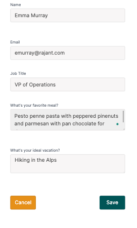

## Set Up and Run Locally
- 1. clone project on your local machine [cloning-a-repository](https://docs.github.com/en/repositories/creating-and-managing-repositories/cloning-a-repository)
- 2. open project in your IDE (ie: visual studio)
- 3. open the terminal at project root and npm install to load all dependencies and configurations
- 4. npm start will start and run the app in your browser [http://localhost:3000](http://localhost:3000)
- 5. The page will automatically reload when you save any changes and show lint warnings and errors

## Set Up and Run in Docker
- 1.

## Next Steps to Continue

- more validation UI clean up and functionality such as error pop outs below invalid inputs on click and hover-over info tags
- accessibilty compliant tabbing functionality, UI and validation expanded
- test and clean up run time efficiency based on Google Analytics (image optimization, lazy-loading)
- create more reusable, flexible components for scalability, readability, and efficiency like form, inputs, error validation ect...
- scale out form template functionality so admin user can CRUD the form template for example, ability to change questions asked and adding more types of inputs like a photo or video
- scale out employee engagement functionality and UI with likes, comments, ranking and sorting card list

## Acceptance Criteria

#### Objective:
- The goal of this assessment is to evaluate your skills and understanding of front end development using ReactJS. Your task is to create a simple application that allows users to manage a list of items. The application should have basic CRUD (Create, Read, Update, and Delete) functionality.

#### Requirements:

- Front End (ReactJS):
- 1. Create a responsive user interface using ReactJS.
- 2. Users should be able to add, view, edit, and delete items from the list.
- 3. Validate user inputs (e.g. empty fields, invalid characters).
- 4. Implement error handling and display appropriate messages to the user.
- 5. Use state management libraries such as Redux or MobX to manage application state.
- 6. Use CSS or CSS-in-JS solutions (e.g. styled-components) for styling.

#### Docker:
- 1. Create a Dockerfile for the front end application.
- 2. Ensure that the application runs smoothly using Docker.

#### Deliverables:
- 1. A fully functional front end application meeting all the requirements outlined above.
- 2. Source code for the front end application.
- 3. Dockerfile and any necessary configuration files.
- 4. A README file with instructions on how to set up, run, and use the application.

#### Submission:
- Please submit your completed assessment as a zip file or a link to a GitHub repository. 
- Ensure that your submission includes all the necessary files and instructions for us to run your application using Docker.

#### Evaluation Criteria:
- Your submission will be evaluated based on the following criteria:

- 1. Functionality: Does the application meet the requirements outlined above?
- 2. Code Quality: Is the code well-organized, readable, and maintainable?
- 3. User Experience: Is the application user-friendly and visually appealing?
- 4. Error Handling: Does the application handle errors and edge cases effectively?
- 5. Scalability: Is the application designed in a way that would allow it to scale easily?

## License

[MIT License](https://opensource.org/licenses/MIT)

**[Back Up To Top](#employee-spotlight-list)**
